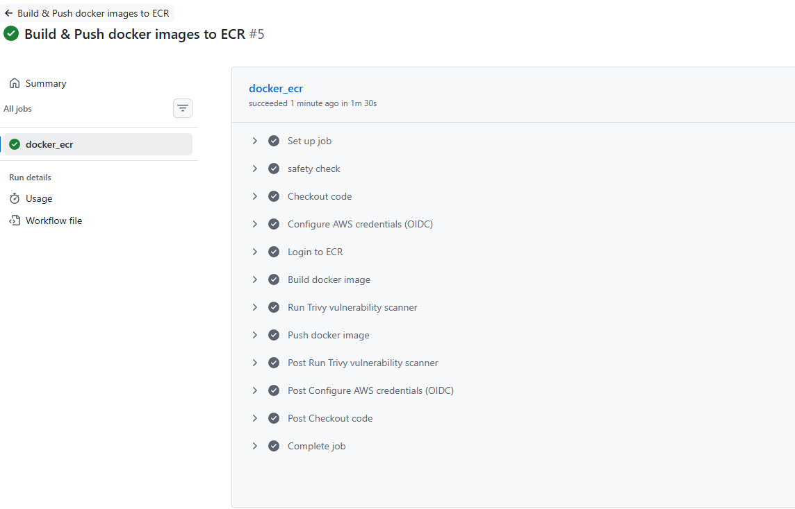
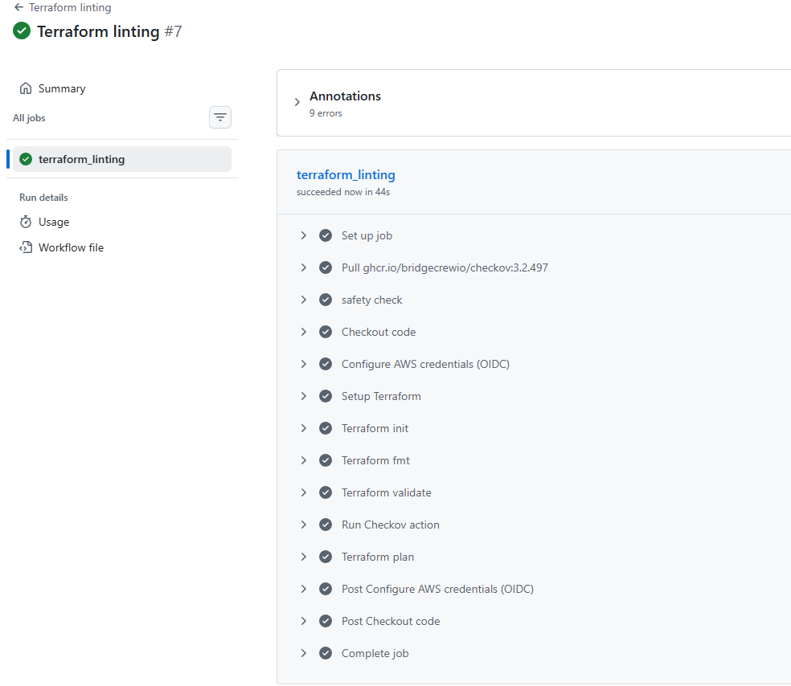
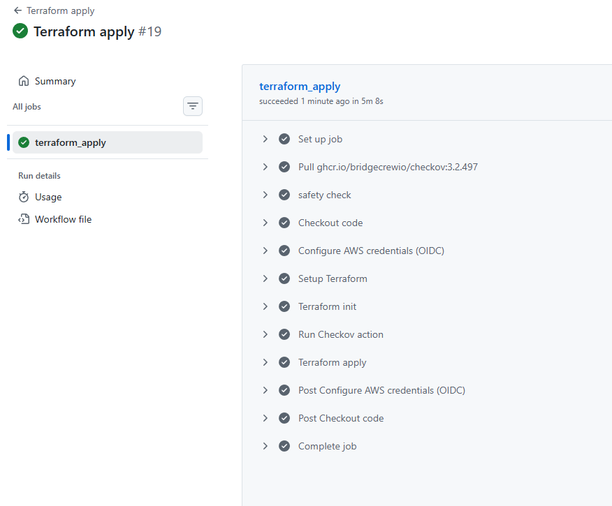
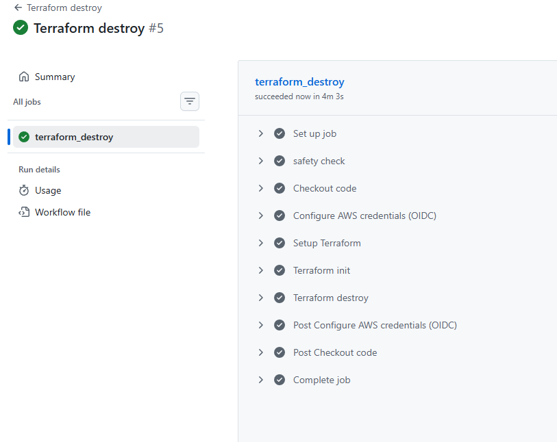

# Gatus on AWS ECS (Terraform + CI/CD)


</img>

---

## Overview

This project deploys **Gatus**, a lightweight uptime and health monitoring service, on **AWS ECS (Fargate)** using **fully modular Terraform** and **secure, manual-triggered CI/CD pipelines**.

The goal is not just to run an application, but to demonstrate how to design and operate a **production-ready cloud setup** with strong defaults around security, networking, reliability, and maintainability, the kind of decisions that matter in real teams and real systems.

---

## What problem this solves

Many demo projects stop at “it runs.” This project goes further and answers:

- How do you run a containerized app **securely** in AWS without public compute?
- How do you manage infrastructure **reproducibly** instead of with ClickOps?
- How do you control deployments and destruction **safely**?
- How do you keep images and infrastructure **continuously scanned**?

The result is a clean reference architecture for running a stateless service on AWS with minimal operational risk.

---

## High-level architecture

- **Application**: Gatus (Go binary, statically compiled)
- **Compute**: ECS with Fargate (no servers to manage)
- **Networking**:
  - VPC spanning **3 Availability Zones**
  - Public subnets for ALB
  - Private subnets for ECS tasks
  - NAT Gateway for controlled outbound access
- **Traffic flow**:
  - Internet → ALB (HTTP redirected to HTTPS)
  - ALB → Target Group → ECS tasks
- **Security**:
  - HTTPS via ACM
  - Strict security groups
  - IAM roles with least privilege
- **State & DNS**:
  - Terraform remote state in S3 with DynamoDB locking
  - Route53 public hosted zone
- **CI/CD**:
  - GitHub Actions with OIDC (no long-lived AWS keys)

---

## Key technical decisions (and why they matter)

### Container build (Golang + Docker)

- **Multi-stage Docker build**
- **Scratch final image**
- **Non-root user**
- **Static binary (CGO disabled)**

Why this matters:
- Very small attack surface
- No OS-level vulnerabilities (confirmed via Trivy)
- Faster cold starts and lower image transfer costs
- Strong security posture by default
- Very small image (~47 MB)

---

### ECS on Fargate (private subnets)

- ECS tasks run **only in private subnets**
- No public IPs assigned
- ALB is the only internet-facing component

Why this matters:
- Reduces blast radius
- Prevents accidental public exposure
- Matches real-world enterprise patterns

---

### Application Load Balancer

- Multi-AZ ALB
- HTTP → HTTPS redirect
- Health checks aligned with `/health`

Why this matters:
- High availability by default
- Enforced encryption
- Clean separation of traffic management from compute

---

### Infrastructure as Code (Terraform)

- Fully modular structure:
  - VPC
  - ALB
  - ECS
  - ECR
  - IAM
  - ACM
  - Route53
  - Security Groups
- Remote state stored in S3
- DynamoDB state locking
- All values variablized and DRY

Why this matters:
- Safe collaboration
- Predictable environments
- Easy teardown and rebuild
- No hidden manual configuration

---

### CI/CD pipelines (GitHub Actions)

Four **manual-triggered** pipelines:

1. **Docker build & push**
   - Builds image
   - Scans with Trivy
   - Pushes to ECR only if clean

2. **Terraform linting**
   - `fmt`, `validate`, `plan`
   - Checkov security scan (soft fail)

3. **Terraform apply**
   - Safety prompt (`type yes`)
   - Checkov security scan (hard fail)
   - Applies infrastructure

4. **Terraform destroy**
   - Explicit confirmation required
   - Clean teardown

All pipelines use **OIDC** to assume an AWS role, no long-lived access keys.

Why this matters:
- No accidental deploys or deletes
- Security checks baked into workflows
- OIDC removes the need for static AWS credentials

---

## Security and networking highlights

- ECS tasks run only in private subnets
- Regional NAT Gateway for controlled outbound traffic
- ALB only allows ports 80 and 443
- ECS only accepts traffic from the ALB security group
- HTTPS enabled by default with ACM
- Least-privilege IAM roles
- Image scanning (Trivy) and IaC scanning (Checkov)

This mirrors how production environments are typically locked down.

---

## Repository structure
```
.
├── gatus/
│ ├── Dockerfile
│ ├── config.yaml
│ ├── go.mod
│ ├── go.sum
│ └── (application source)
│
├── infra/
│ ├── main.tf
│ ├── providers.tf
│ ├── variables.tf
│ ├── outputs.tf
│ └── modules/
│ ├── vpc/
│ ├── alb/
│ ├── ecs/
│ ├── ecr/
│ ├── iam/
│ ├── acm/
│ ├── route53/
│ └── sg/
│
├── .github/
│ └── workflows/
│ ├── docker-build-push.yaml
│ ├── terraform-linting.yaml
│ ├── terraform-apply.yaml
│ └── terraform-destroy.yaml
│
└── README.md
```

---

## Tech stack

- **App**: Go
- **Containerization**: Docker
- **Cloud**: AWS (ECS, ALB, ECR, VPC, Route53, ACM, IAM)
- **Infrastructure as Code**: Terraform
- **CI/CD**: GitHub Actions (OIDC)
- **Security**: Trivy, Checkov
- **Logging**: CloudWatch Logs

---

## Run locally

```bash
cd gatus
docker build -t gatus:latest .
docker run -d -p 8080:8080 gatus:latest
curl http://localhost:8080/health
```
Expected response:
```bash
{"status":"UP"}
```
---

## Screenshots and demo
A short demo of the Gatus app deployed on the web browser:

<video controls src="resources/giphy.mp4" title="Title"></video>

Screenshots of the CI/CD pipelines working:





---

## Future improvements

- Add autoscaling policies based on ALB metrics
- Introduce blue/green or canary deployments
- Add WAF in front of the ALB
- Parameterize environment support (dev/stage/prod)
- Add synthetic monitoring for the monitoring system itself

---

This repository is meant to show how decisions are made, not just that things work.


